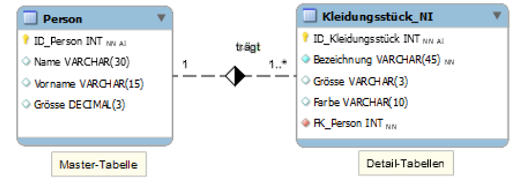
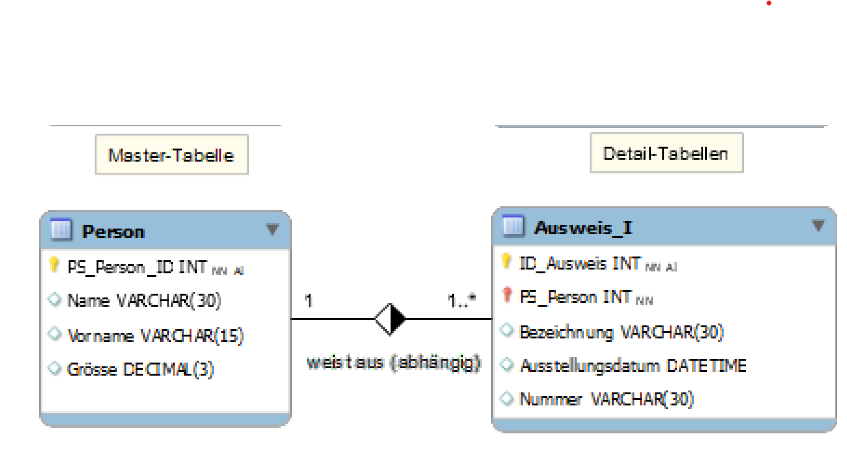
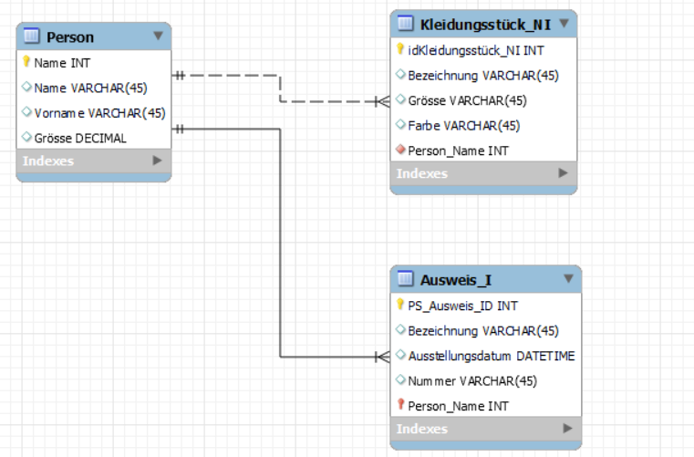

# Beziehungsarten Indentifying / Non-Identifying relationship
## 2 Arten von Beziehungen in Datenbanken
Identifiying:  
Der Foreign Key ist Teil des Primary Keys der Child Tabelle
Fremdschlüssel ist Bestandteil des Indentifikationsschlüsseks 

Non identifiying Relationships:  Foreign Key ist kein Teil des Primary Keys der Child Tabelle, Beispiel ist die Beziehung Mitarbeiter/Abteilung.
Der Fremdschlüssel aif den Arbeitgeber gehört nähmlich nicht zu identität einer Person. Jedenfalls nicht der Inhalt. 

## Auftrag
Beispiel mit zwei unterschiedlichen Beziehungen erstellen:
](image-5.png)

Eigene Beispiele wo identifying Beziehung sinn macht: 
- Gebäude und Räume 

- Identifiying könnten Vorlesungen und Prüfungen sein,
Non-Identifying zwischen Professoren und Vorlesungen.

- Ein Beispiel was auch sinn macht sind bestellungen und - Bestellpositionen. Eine Bestellung hat mehrere Bestellpositionen.

- Buch und Kapitel, Kapitel gehören zu einem Buch und es kann beliebig - - viele enthalten. Ein Kapitel gehört immer nur zu einem Buch

Andere Beispiele:
- Schloss und Schlüssel
- Fahrzeug und Fahrzeugzulassubg

Phind Beispiele Anwendungsfälle:

- Artikel und Zitierungen, ein Artikel kann mehrere Zitierungen haben

- Konferenz und Vorträge, eine Konferenz besteht aus mehreren Vorträgen.

Aussehen SQL Statements Non Identifying und Identifying:
Identifying-> Der Primärschlüssel der Childtable enthält den Primärschlüssel der Parenttable.
Non identifying-> Der Primärschlüssel der Childtable ist unabhängig vom Primärschlüssel der Parenttable, obwohl er einen Fremdschlüssel zur Parenttable hat.
