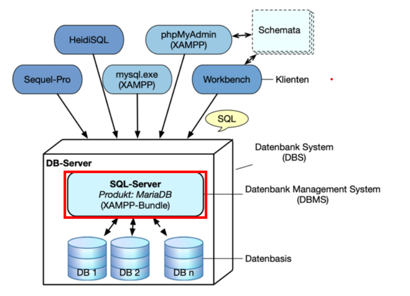
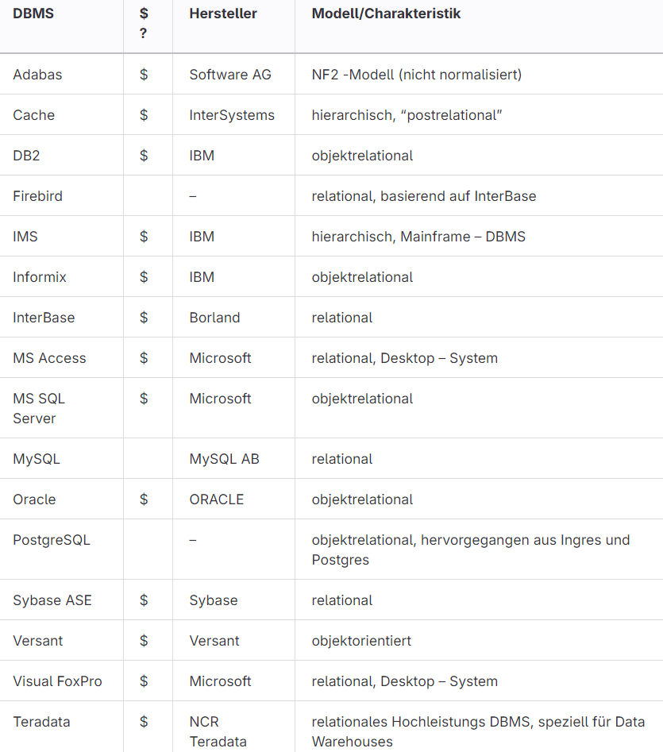
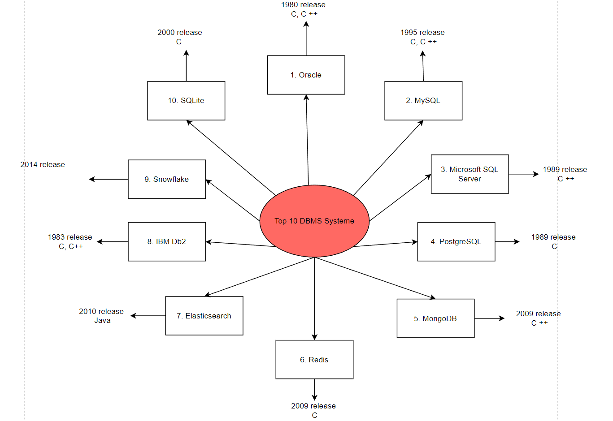

# DBMS (Datenbank Management System)
## Erklärung
System zur elektronischen Datenverwalatung. Aufgabe ist es, grosse Datenmengen effizient, wiederspruchsfrei und dauerhaft zu speichern. 

DBMS besteht aus zwei Teilen: Verwatlungssoftware (Organisiert die Struktur intern und Speicherung etc.) genannt Datenbankmanagementsystem und Menge der zu verwaltenden Daten also die eigentliche Datenbank. 

## Merkmale DBMS
Integrierte Datenhaltung: 
Ein Datenbankmanagementsystem (DBMS) verwaltet zentral alle von Anwendungen benötigten Daten. Dadurch wird jedes Datenelement, wie z.B. der Name eines Kunden, nur einmal in der Datenbank gespeichert. Ein DBMS ermöglicht die Definition komplexer Beziehungen zwischen Daten und verknüpft sie schnell und effizient. Kontrollierte Redundanz kann die Verarbeitungseffizienz verbessern.Ein DBMS sollte diverse Benutzeroberflächen bereitstellen, darunter Anfragesprachen, Programmierschnittstellen und grafische Oberflächen (GUI). Webzugriff ist heutzutage essentiell. Der Katalog (Data Dictionary) erlaubt den Zugriff auf Datenbeschreibungen (Metadaten).

Benutzersichten:
Verschiedene Benutzergruppen benötigen unterschiedliche Sichten auf die Datenbank, die spezifische Daten enthalten und diese entsprechend der Anwendung strukturieren. Diese Sichten sind im externen Schema der Datenbank definiert.

Konsistenzkontrolle:
Die Konsistenzkontrolle stellt die Korrektheit der Datenbankinhalte und die korrekte Ausführung von Änderungen sicher. Dies geschieht durch Integritätsbedingungen und die Sicherstellung der physischen Integrität der Daten.

Datenzugriffskontrolle:
Regeln verhindern unautorisierten Zugriff auf die Datenbank, schützen personenbezogene und firmenspezifische Daten und können auch auf Sichten angewendet werden.

Transaktionen:
Mehrere Datenbankänderungen können zu Transaktionen zusammengefasst werden, die als eine Einheit ausgeführt werden und deren Erfolg dauerhaft gespeichert wird.

Mehrbenutzerfähigkeit:
Das DBMS synchronisiert konkurrierende Transaktionen, um Konflikte zu vermeiden und sorgt dafür, dass Benutzern eine isolierte Datenansicht erscheint.

Datensicherung:
Das DBMS stellt bei Hard- oder Softwarefehlern einen korrekten Datenbankzustand wieder her (Recovery).

## Vorteile Datenbankeinsatz
Nutzung von Standarts:
Erleichtert Einführung und Umsetzung von zentralen Starndarts in der Datenorganisation.

Effizienter Datenzugriff:
DBMS braucht komplizierte Techniken zum effizienten Speichern und auslesen

Kürzere Softwareentwicklungszeiten:
viele wichtige Funktionen werden angeboten, im zusammenhang mit den angebotenen Dtaenbanksprachen wird eine schnellere Anwendungsentwicklung ermöglicht. 

Hohe Flexibilität:
Struktur kann sich ändern bei anderen Anforderungen ohne grosse Konsequenzen

Hohe Verfügbarkeit:
DBMS stellt die Datenbank allen benutzern gleichzeitig zur Verfügung

Grosse Wirtschaftlichkeit: 
Einsatz von DBMS reduziert Betriebs und Verwaltungskosten

## Nachteile Datenbanksysteme
- Hohe Anfangsinvestitionen (Hardware, Software)
- Weniger effizient für spezialisierte Anwendungen
- Optimierung nur für einen Teil der Programme möglich
- Mehrkosten (Datensicherheit, Synchronisation, Konsistenzkontrolle)
- Hochqualifiziertes Personal erforderlich
- Verwundbarkeit durch Zentralisierung
- Einsatz regulärer Dateien sinnvoll bei:

- Kein gleichzeitiger Mehrbenutzerzugriff
- Feste Echtzeitanforderungen
- Einfache, wohldefinierte und unveränderliche Daten und Anwendungen

## Produkte

## Auftrag
Vergleiche Sie die obige Liste mit der aktuellen DB-Ranking: DB-Engine Ranking. Nehmen Sie die wichtigsten 10 DB-Engines in ein Mindmap auf

Mindmap:

