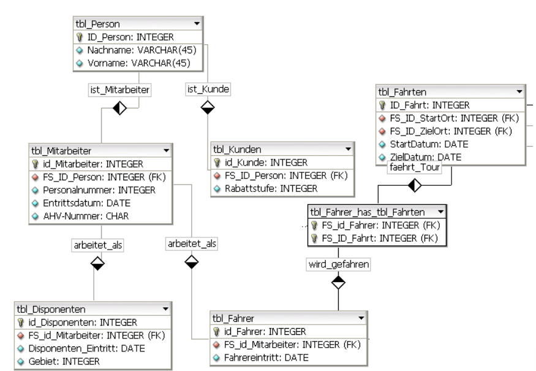

# Generalisierung Spezialisierung
## 1. Erklärung Learn
Datenbankmodellierung beruht auf Attributkonzept
Man definiert Attribute mit Attributsausprägubgeb und ordnet diese den Entitätstypen zu. Problem ist, wenn mehrere Entitätstypen Attribute gemeinsam haben. Dann entsteht Redundanz. In disem Beispiel ist dass, wenn Mitarbeiter welche auch als Kunden auftreten oder Fahrer die als Disponenten arbeiten. Um einen Informationsverlust zu vermeiden, müssen die Datensätze der spezialisierten Tabellen per Fremdschlüssel auf die generalisierten Tabellen verweisen. Diese Beziehung wird auch als „is-a“-Beziehung bezeichnet: eine Person ist ein Fahrer.

## 2. Beispiel mit Vererbung

## 3. Auftrag
Beispiel Screenshot: 

Eigenes Beispiel Generalisierung:

Phind:

Im Alltag und generell wird die Umsetzung von Generalisierung und Spezialisierung in einer Datenbank häufig eingesetzt, um komplexe Datenmodelle effizient und übersichtlich zu gestalten. Diese Techniken ermöglichen es, Datenstrukturen zu vereinfachen und gleichzeitig Flexibilität und Skalierbarkeit zu gewährleisten. Hier sind einige praktische Beispiele, wie diese Konzepte angewendet werden können:

Generalisierung
Beispiel: Angenommen, eine Organisation hat Mitarbeiter, die in verschiedenen Rollen arbeiten, wie z.B. Ingenieure, Techniker und Administratoren. Stattdessen von einer allgemeinen Entität "Mitarbeiter" aus, die Attribute wie Name, Geburtsdatum, Adresse usw. enthält, können spezifische Rollen wie Ingenieur, Techniker und Administrator als spezialisierte Entitäten definiert werden, die zusätzliche Attribute haben, die für ihre Rolle relevant sind, wie z.B. Fachgebiet für Ingenieure oder Werkzeugkategorie für Techniker.

Spezialisierung
Beispiel: Eine universelle Entität "Produkt" könnte Attribute wie Produktname, Preis und Hersteller enthalten. Durch Spezialisierung können spezielle Produkttypen wie Elektronikprodukte, Kleidung oder Haushaltsartikel als spezialisierte Entitäten definiert werden, die zusätzliche Attribute haben, die für ihren speziellen Typ relevant sind, wie z.B. Batterielaufzeit für Elektronikprodukte oder Größe für Kleidungsstücke.

Einsatz im Alltag
Unternehmensführung: In Unternehmen werden diese Techniken verwendet, um Mitarbeiterdaten zu organisieren, wobei allgemeine Attribute wie Name und Kontaktinformationen gemeinsam gehalten werden, während spezifische Rollen und Abteilungen durch spezialisierte Entitäten modelliert werden.
  
E-Commerce: Online-Shops verwenden Generalisierung und Spezialisierung, um Produkte zu kategorisieren und zu organisieren. Die allgemeine Entität "Produkt" enthält grundlegende Informationen, während spezialisierte Entitäten wie "Elektronik", "Mode" oder "Haushaltsgeräte" spezifische Produktattribute und Kategorien berücksichtigen.

Diese Beispiele zeigen, wie Generalisierung und Spezialisierung in der Datenbankmodellierung dazu beitragen, Datenstrukturen flexibel und effizient zu gestalten, was besonders wichtig ist, wenn mit komplexen und variablen Datensätzen gearbeitet wird.
