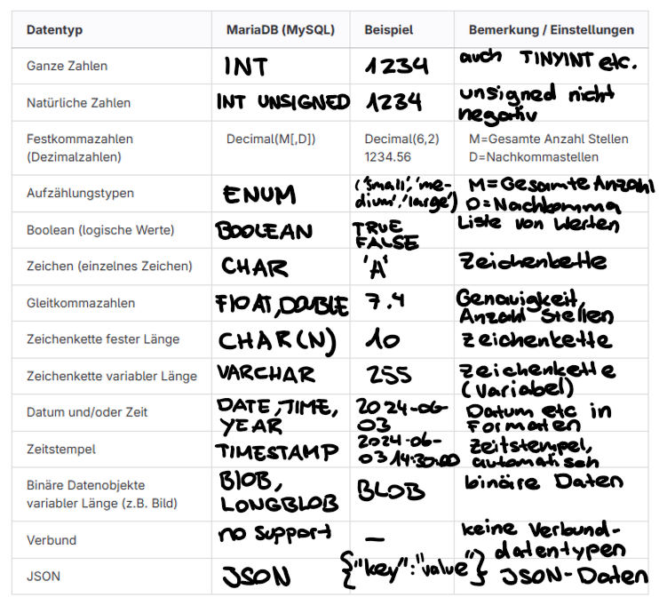

# Datentypen

## Tabelle:


## Mehrfachbeziehungen
Bei Mehrfachbeziehungen gibt es mehrere unabhängige Beziehungen zwischen zwei Tabellen, die unterschiedliche Sachverhalte repräsentieren und eindeutig gekennzeichnet werden müssen. Diese Beziehungen können unterschiedliche Kardinalitäten haben. Ein Beispiel zeigt drei unabhängige Beziehungen zwischen tbl_Fahrten und tbl_Orte, darunter eine mc, die eine Transformationstabelle erfordert.

## Rekursion
Es gibt auch Assoziationen innerhalb einer Tabelle, bei denen ein Datensatz mit einem anderen Datensatz derselben Tabelle in Beziehung steht, was eine Hierarchie darstellt. Dies wird durch einen Fremdschlüssel erreicht, der auf den Identifikationsschlüssel der eigenen Tabelle verweist. Ein Beispiel ist eine Firmenorganisation, bei der jede Person einen Vorgesetzten hat, außer der höchsten Person, was eine c
ist.

## Einfache Hirarchie Netzwekstruktur
Eine Netzwerkstruktur erfordert eine mc
und eine Transformationstabelle, wobei die Fremdschlüssel auf Identifikationsschlüssel derselben Tabelle verweisen, aber unterschiedliche Rollen haben. Einfache Hierarchien können mit einem Fremdschlüssel innerhalb der gleichen Tabelle abgebildet werden, wobei das Topelement einen NULL-Wert hat. Wenn mehrere Oberelemente zugelassen sind, wird eine mc
benötigt, und eine Transformationstabelle gibt an, welches Oberelement zu welchem Unterelement gehört.

## Stücklistenproblem
Beim Stücklistenproblem in der Datenmodellierung besteht die Herausforderung darin, eine Liste von Einzelteilen zu erstellen, die alle nicht zusammengesetzten Artikel enthält. Produkte und ihre Bestandteile befinden sich in derselben Tabelle und können rekursiv in einer anderen Tabelle erfasst werden, die die Zusammensetzungen speichert. Eine einfache Hierarchie reicht nicht aus, daher ist eine zusätzliche Tabelle erforderlich, um die Beziehungen und Mengen der Bestandteile zu den Aggregaten festzuhalten.

### Auftrag
```

```

## Datenbearbeitung der Datenbasis

## Daten auslesen

## Erweiterter Tourenplaner mit Daten füllen

