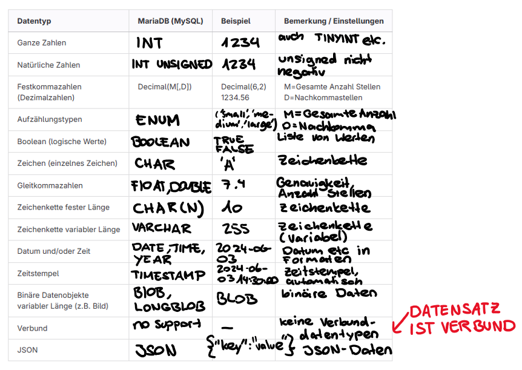

# Datentypen und Beziehungen

## Tabelle:


## Mehrfachbeziehungen
Bei Mehrfachbeziehungen gibt es mehrere unabhängige Beziehungen zwischen zwei Tabellen, die unterschiedliche Sachverhalte repräsentieren und eindeutig gekennzeichnet werden müssen. Diese Beziehungen können unterschiedliche Kardinalitäten haben. Ein Beispiel zeigt drei unabhängige Beziehungen zwischen tbl_Fahrten und tbl_Orte, darunter eine mc, die eine Transformationstabelle erfordert.

## Rekursion
Es gibt auch Assoziationen innerhalb einer Tabelle, bei denen ein Datensatz mit einem anderen Datensatz derselben Tabelle in Beziehung steht, was eine Hierarchie darstellt. Dies wird durch einen Fremdschlüssel erreicht, der auf den Identifikationsschlüssel der eigenen Tabelle verweist. Ein Beispiel ist eine Firmenorganisation, bei der jede Person einen Vorgesetzten hat, außer der höchsten Person, was eine c
ist.

## Einfache Hirarchie Netzwekstruktur
Eine Netzwerkstruktur erfordert eine mc
und eine Transformationstabelle, wobei die Fremdschlüssel auf Identifikationsschlüssel derselben Tabelle verweisen, aber unterschiedliche Rollen haben. Einfache Hierarchien können mit einem Fremdschlüssel innerhalb der gleichen Tabelle abgebildet werden, wobei das Topelement einen NULL-Wert hat. Wenn mehrere Oberelemente zugelassen sind, wird eine mc
benötigt, und eine Transformationstabelle gibt an, welches Oberelement zu welchem Unterelement gehört.

## Stücklistenproblem
Beim Stücklistenproblem in der Datenmodellierung besteht die Herausforderung darin, eine Liste von Einzelteilen zu erstellen, die alle nicht zusammengesetzten Artikel enthält. Produkte und ihre Bestandteile befinden sich in derselben Tabelle und können rekursiv in einer anderen Tabelle erfasst werden, die die Zusammensetzungen speichert. Eine einfache Hierarchie reicht nicht aus, daher ist eine zusätzliche Tabelle erforderlich, um die Beziehungen und Mengen der Bestandteile zu den Aggregaten festzuhalten.

### Auftrag
Generalisierung Tabelle  Mitarbeiter:
```
CREATE TABLE tbl_Mitarbeiter (
    MitarbeiterID INT AUTO_INCREMENT PRIMARY KEY,
    Name VARCHAR(255) NOT NULL,
    Position VARCHAR(255) NOT NULL
);

```

Mehrfachbeziehungen:
```
CREATE TABLE tbl_Fahrten (
    FahrtID INT AUTO_INCREMENT PRIMARY KEY,
    Beschreibung VARCHAR(255) NOT NULL,
    Datum DATE NOT NULL
);

CREATE TABLE tbl_Orte (
    OrtID INT AUTO_INCREMENT PRIMARY KEY,
    Name VARCHAR(255) NOT NULL,
    Adresse VARCHAR(255) NOT NULL
);

CREATE TABLE tbl_Fahrten_Orte (
    FahrtID INT,
    OrtID INT,
    Rolle VARCHAR(255),
    PRIMARY KEY (FahrtID, OrtID, Rolle),
    FOREIGN KEY (FahrtID) REFERENCES tbl_Fahrten(FahrtID),
    FOREIGN KEY (OrtID) REFERENCES tbl_Orte(OrtID)
);
```

Hirarchie und Rekursionen:
``` 
CREATE TABLE tbl_Fahrten (
    FahrtID INT AUTO_INCREMENT PRIMARY KEY,
    Beschreibung VARCHAR(255) NOT NULL,
    Datum DATE NOT NULL
);

CREATE TABLE tbl_Orte (
    OrtID INT AUTO_INCREMENT PRIMARY KEY,
    Name VARCHAR(255) NOT NULL,
    Adresse VARCHAR(255) NOT NULL
);

CREATE TABLE tbl_Fahrten_Orte (
    FahrtID INT,
    OrtID INT,
    Rolle VARCHAR(255),
    PRIMARY KEY (FahrtID, OrtID, Rolle),
    FOREIGN KEY (FahrtID) REFERENCES tbl_Fahrten(FahrtID),
    FOREIGN KEY (OrtID) REFERENCES tbl_Orte(OrtID)
);
```

Netzwerkstruktur:
```
CREATE TABLE tbl_Mitarbeiter_Netzwerk (
    VorgesetzterID INT,
    MitarbeiterID INT,
    Rolle VARCHAR(255),
    PRIMARY KEY (VorgesetzterID, MitarbeiterID, Rolle),
    FOREIGN KEY (VorgesetzterID) REFERENCES tbl_Mitarbeiter(MitarbeiterID),
    FOREIGN KEY (MitarbeiterID) REFERENCES tbl_Mitarbeiter(MitarbeiterID)
);
```

Stücklisteproblem:
```
CREATE TABLE component (
    ComponentID INT AUTO_INCREMENT PRIMARY KEY,
    Name VARCHAR(255) NOT NULL
);

CREATE TABLE subcomponent (
    ComponentID INT,
    SubcomponentID INT,
    Menge INT NOT NULL,
    PRIMARY KEY (ComponentID, SubcomponentID),
    FOREIGN KEY (ComponentID) REFERENCES component(ComponentID),
    FOREIGN KEY (SubcomponentID) REFERENCES component(ComponentID)
);
```


## Datenbearbeitung der Datenbasis
Auftrag Insert:
```
INSERT INTO kunden (vorname, nachname, land_id, wohnort) VALUES ('Heinrich', 'Schmitt', 2, 'Zürich');

INSERT INTO kunden (vorname, nachname, land_id, wohnort) VALUES ('Sabine', 'Müller', 2, 'Bern');

INSERT INTO kunden (vorname, nachname, land_id, wohnort) VALUES ('Markus', 'Mustermann', 1, 'Wien');

INSERT INTO kunden (kunde_id, vorname, nachname, land_id, wohnort) VALUES (NULL, 'Herr', 'Maier', NULL, NULL);

INSERT INTO kunden (kunde_id, vorname, nachname, land_id, wohnort) VALUES (NULL, 'Herr', 'Bulgur', NULL, 'Sirnach');

INSERT INTO kunden (kunde_id, vorname, nachname, land_id, wohnort) VALUES (NULL, 'Maria', 'Manta', NULL, NULL);

INSERT INTO kunden (nachname, wohnort, land_id) VALUES ('Fesenkampp', 'Duisburg', 3);

INSERT INTO kunden (vorname) VALUES ('Herbert');

INSERT INTO kunden (nachname, vorname, wohnort, land_id) VALUES ('Schulter', 'Albert', 'Duisburg', 1);

INSERT INTO kunden (vorname, nachname, wohnort, land_id) VALUES ('Brunhild', 'Sulcher', 'Süderstade', 1);

INSERT INTO kunden (vorname, nachname, land_id, wohnort) VALUES ('Jochen', 'Schmied', 2, 'Solingen');

INSERT INTO kunden (vorname, nachname, land_id, wohnort) VALUES ('', 'Doppelbrecher', 2, '');

INSERT INTO kunden (vorname, nachname, wohnort, land_id) VALUES ('Fesenkampp', 'Christoph', 'Duisburg', 3);

INSERT INTO kunden (vorname) VALUES ('Herbert');

INSERT INTO kunden (nachname, vorname, wohnort, land_id) VALUES ('Schulter', 'Albert', 'Duisburg', 1);

INSERT INTO kunden (vorname, nachname, land_id, wohnort) VALUES ('Brunhild', 'Sulcher', 1, 'Süderstade');

INSERT INTO kunden (vorname, nachname, land_id, wohnort) VALUES ('Jochen', 'Schmied', 2, 'Solingen');
```

Auftrag Update, Delete, Alter, Drop:
```
UPDATE regisseur SET vorname = 'Etan' WHERE nachname = 'Cohen';

UPDATE filme SET dauer = 120 WHERE titel = 'Angst';

RENAME TABLE DVD TO bluray_sammlung;

ALTER TABLE bluray_sammlung ADD COLUMN preis DECIMAL(10, 2);

DELETE FROM bluray_sammlung WHERE titel = 'Angriff auf Rom' AND regisseur_id = (SELECT regisseur_id FROM regisseur WHERE nachname = 'Burghofer' AND vorname = 'Steven');

ALTER TABLE bluray_sammlung CHANGE COLUMN filme kinofilme VARCHAR(255);

ALTER TABLE bluray_sammlung DROP COLUMN nummer;

DROP TABLE bluray_sammlung;
```

## Daten auslesen
Select Auftrag:
```
-- Setzen des Datenbank-Kontexts
USE filmedatenbank;

-- Anweisungen zur Datenabfrage
SELECT * FROM dvd_sammlung;
SELECT film, nummer FROM dvd_sammlung;
SELECT film, regisseur FROM dvd_sammlung;
SELECT film FROM dvd_sammlung WHERE regisseur = 'Quentin Tarantino';
SELECT film FROM dvd_sammlung WHERE regisseur = 'Steven Spielberg';
SELECT film FROM dvd_sammlung WHERE regisseur LIKE 'Steven %';
SELECT film FROM dvd_sammlung WHERE laenge_minuten > 120;
SELECT film FROM dvd_sammlung WHERE regisseur IN ('Quentin Tarantino', 'Steven Spielberg');
SELECT film FROM dvd_sammlung WHERE regisseur = 'Quentin Tarantino' AND laenge_minuten < 90;
SELECT film FROM dvd_sammlung WHERE film LIKE '%Sibirien%';
SELECT film FROM dvd_sammlung WHERE film LIKE '%Das große Rennen%';
SELECT film, regisseur FROM dvd_sammlung ORDER BY regisseur;
SELECT film, regisseur FROM dvd_sammlung ORDER BY regisseur, film;
SELECT film FROM dvd_sammlung WHERE regisseur = 'Quentin Tarantino' ORDER BY laenge_minuten DESC;
```

## Erweiterter Tourenplaner mit Daten füllen
```
CREATE SCHEMA IF NOT EXISTS `mydb` DEFAULT CHARACTER SET utf8 ;
USE `mydb` ;

DROP TABLE IF EXISTS `Ortschaft` ;

CREATE TABLE IF NOT EXISTS `Ortschaft` (
  `Ortschaft_id` INT NOT NULL,
  `PLZ` VARCHAR(45) NOT NULL,
  `Beschriftung` VARCHAR(45) NOT NULL,
  PRIMARY KEY (`Ortschaft_id`))
ENGINE = InnoDB;


DROP TABLE IF EXISTS `Fahrzeug` ;

CREATE TABLE IF NOT EXISTS `Fahrzeug` (
  `Fahrzeugkennzeichner` VARCHAR(45) NOT NULL,
  `Sitz_Plaetze` VARCHAR(45) NOT NULL,
  PRIMARY KEY (`Fahrzeugkennzeichner`))
ENGINE = InnoDB;


DROP TABLE IF EXISTS `Mitarbeiter` ;

CREATE TABLE IF NOT EXISTS `Mitarbeiter` (
  `Mitarbeiter_id` INT NOT NULL,
  `Vorname` VARCHAR(45) NOT NULL,
  `Nachname` VARCHAR(45) NOT NULL,
  `Telefonnummer` VARCHAR(45) NOT NULL,
  `FK_Vorgesetzter` INT NULL,
  PRIMARY KEY (`Mitarbeiter_id`),
  INDEX `fk_Mitarbeiter_Vorgesetzter_idx` (`FK_Vorgesetzter` ASC),
  CONSTRAINT `fk_Mitarbeiter_Vorgesetzter`
    FOREIGN KEY (`FK_Vorgesetzter`)
    REFERENCES `Mitarbeiter` (`Mitarbeiter_id`)
    ON DELETE NO ACTION
    ON UPDATE NO ACTION)
ENGINE = InnoDB;


DROP TABLE IF EXISTS `Disponent` ;

CREATE TABLE IF NOT EXISTS `Disponent` (
  `Disponent_id` INT NOT NULL,
  `FK_Mitarbeiter` INT NOT NULL,
  `Disponentennummer` VARCHAR(45) NOT NULL,
  PRIMARY KEY (`Disponent_id`, `FK_Mitarbeiter`),
  INDEX `fk_Disponent_Mitarbeiter1_idx` (`FK_Mitarbeiter` ASC),
  CONSTRAINT `fk_Disponent_Mitarbeiter1`
    FOREIGN KEY (`FK_Mitarbeiter`)
    REFERENCES `Mitarbeiter` (`Mitarbeiter_id`)
    ON DELETE NO ACTION
    ON UPDATE NO ACTION)
ENGINE = InnoDB;


DROP TABLE IF EXISTS `Fahrer` ;

CREATE TABLE IF NOT EXISTS `Fahrer` (
  `Fahrer_id` INT NOT NULL,
  `FK_Mitarbeiter` INT NOT NULL,
  `Fahrernummer` VARCHAR(45) NOT NULL,
  PRIMARY KEY (`Fahrer_id`, `FK_Mitarbeiter`),
  INDEX `fk_Fahrer_Mitarbeiter_idx` (`FK_Mitarbeiter` ASC),
  CONSTRAINT `fk_Fahrer_Mitarbeiter`
    FOREIGN KEY (`FK_Mitarbeiter`)
    REFERENCES `Mitarbeiter` (`Mitarbeiter_id`)
    ON DELETE NO ACTION
    ON UPDATE NO ACTION)
ENGINE = InnoDB;


DROP TABLE IF EXISTS `Fahrer_Disponent` ;

CREATE TABLE IF NOT EXISTS `Fahrer_Disponent` (
  `Fahrer_id` INT NOT NULL,
  `Disponent_id` INT NOT NULL,
  PRIMARY KEY (`Fahrer_id`, `Disponent_id`),
  INDEX `fk_Fahrer_Disponent_Fahrer_idx` (`Fahrer_id` ASC),
  INDEX `fk_Fahrer_Disponent_Disponent_idx` (`Disponent_id` ASC),
  CONSTRAINT `fk_Fahrer_Disponent_Fahrer`
    FOREIGN KEY (`Fahrer_id`)
    REFERENCES `Fahrer` (`Fahrer_id`)
    ON DELETE NO ACTION
    ON UPDATE NO ACTION,
  CONSTRAINT `fk_Fahrer_Disponent_Disponent`
    FOREIGN KEY (`Disponent_id`)
    REFERENCES `Disponent` (`Disponent_id`)
    ON DELETE NO ACTION
    ON UPDATE NO ACTION)
ENGINE = InnoDB;


DROP TABLE IF EXISTS `Tour` ;

CREATE TABLE IF NOT EXISTS `Tour` (
  `Tour_id` INT NOT NULL,
  `FK_Fahrzeug` VARCHAR(45) NOT NULL,
  `FK_Disponent` INT NOT NULL,
  PRIMARY KEY (`Tour_id`),
  INDEX `fk_Tour_Fahrzeug1_idx` (`FK_Fahrzeug` ASC),
  INDEX `fk_Tour_Disponent1_idx` (`FK_Disponent` ASC),
  CONSTRAINT `fk_Tour_Fahrzeug1`
    FOREIGN KEY (`FK_Fahrzeug`)
    REFERENCES `Fahrzeug` (`Fahrzeugkennzeichner`)
    ON DELETE NO ACTION
    ON UPDATE NO ACTION,
  CONSTRAINT `fk_Tour_Disponent1`
    FOREIGN KEY (`FK_Disponent`)
    REFERENCES `Disponent` (`Disponent_id`)
    ON DELETE NO ACTION
    ON UPDATE NO ACTION)
ENGINE = InnoDB;

DROP TABLE IF EXISTS `Station` ;

CREATE TABLE IF NOT EXISTS `Station` (
  `Station_id` INT NOT NULL,
  `Tour_id` INT NOT NULL,
  `Station_name` TEXT NULL,
  `FK_Ortschaft` INT NOT NULL,
  `Parent_Station_id` INT NULL,
  PRIMARY KEY (`Station_id`, `FK_Ortschaft`),
  INDEX `fk_Station_Ortschaft1_idx` (`FK_Ortschaft` ASC),
  INDEX `fk_Station_Parent_Station_idx` (`Parent_Station_id` ASC),
  INDEX `fk_Station_Tour_idx` (`Tour_id` ASC),
  CONSTRAINT `fk_Station_Ortschaft1`
    FOREIGN KEY (`FK_Ortschaft`)
    REFERENCES `Ortschaft` (`Ortschaft_id`)
    ON DELETE NO ACTION
    ON UPDATE NO ACTION,
  CONSTRAINT `fk_Station_Parent_Station`
    FOREIGN KEY (`Parent_Station_id`)
    REFERENCES `Station` (`Station_id`)
    ON DELETE NO ACTION
    ON UPDATE NO ACTION,
  CONSTRAINT `fk_Station_Tour`
    FOREIGN KEY (`Tour_id`)
    REFERENCES `Tour` (`Tour_id`)
    ON DELETE NO ACTION
    ON UPDATE NO ACTION)
ENGINE = InnoDB;


DROP TABLE IF EXISTS `Stop_in_tour` ;

SELECT 
    t.Tour_id AS `Tour-Nummer`,
    (SELECT CONCAT(SUBSTRING_INDEX(s.Station_Name, ' ', 1), ', ', o.PLZ, ' ', o.Beschriftung)
     FROM Station s
     JOIN Ortschaft o ON s.FK_Ortschaft = o.Ortschaft_id
     WHERE s.Tour_Id = t.Tour_id
     ORDER BY s.Station_id
     LIMIT 1) AS `Start-Ort`,
    (SELECT CONCAT(SUBSTRING_INDEX(s.Station_Name, ' ', 1), ', ', o.PLZ, ' ', o.Beschriftung)
     FROM Station s
     JOIN Ortschaft o ON s.FK_Ortschaft = o.Ortschaft_id
     WHERE s.Tour_Id = t.Tour_id
     ORDER BY s.Station_id DESC
     LIMIT 1) AS `Ziel-Ort`,
    GROUP_CONCAT(CONCAT(SUBSTRING_INDEX(s.Station_Name, ' ', 1), ', ', o.PLZ, ' ', o.Beschriftung) ORDER BY s.Station_id SEPARATOR ' ') AS `Via`
FROM Tour t
JOIN  Station s ON t.Tour_id = s.Tour_Id
JOIN  Ortschaft o ON s.FK_Ortschaft = o.Ortschaft_id
GROUP BY t.Tour_id;
```


## Checkpoint
- Welche Schwierigkeiten beim Einfügen von Daten ergeben sich, wenn z.B. der FK_Vorgesetzer als Constraint definiert ist? (Tipp: ref. Integrität)
Beim Einfügen von Daten in eine Tabelle mit dem FK_Vorgesetzter als Constraint kann man Schwierigkeiten bekommen, wenn der referenzierte Vorgesetzte noch nicht existiert. Das verletzt die referenzielle Integrität und verhindert das Einfügen. Man muss sicher gehen, dass alle referenzierten Vorgesetzten vorher schon in der Tabelle existieren.

- Warum ist der Wert NULL in der tbl_Hierarchie nicht zulässig? (Tipp: Kardinalität)
Ein NULL-Wert in der tbl_Hierarchie ist nicht erlaubt, da die Kardinalität eine Hierarchie verlangt. Jede Position muss eindeutig einer anderen Position oder dem obersten zugeordnet sein, um die Struktur der Hierarchie zu bewahren. Ein NULL-Wert würde diese Zuordnung verstossen.

- Wann muss eine Hierarchie-Tabelle anstelle einer rekursiven Beziehung eingesetzt werden? (Tipp: Chefs)
Eine Hierarchie-Tabelle wird anstelle einer rekursiven Beziehung eingesetzt, wenn die Anzahl der Hierarchieebenen fest ist. Bei grossen Organisationen kann eine feste Struktur übersichtlicher und performanter sein als rekursive Abfragen.

- Überprüfen Sie ihre SQL-Datentypen-Tabelle: Check Präsentation
habe ich
