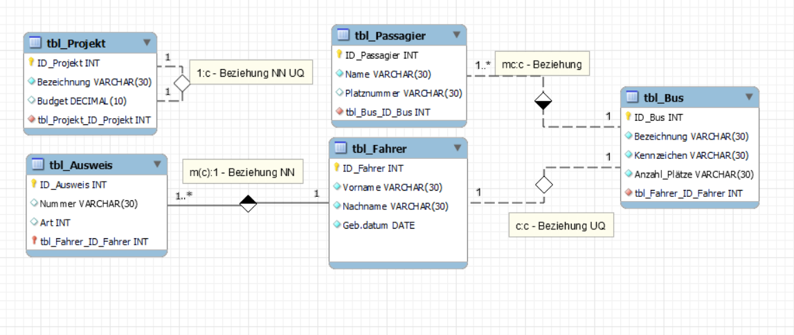
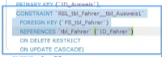

# Beziehungen mit Einschränkungen (constraint) erstellen

## Input Notizen
Input Kellenberger (screenshot einfügen)

Wenn wir zwei Tabellen haben mit Beziehung dazwischen, dann gibt es 4 Möglichkeiten ( 1:1, 1:c, 1:m, 1:mc, c:mc, c:c).
Je nach dem wie die Beziehung ist muss mal not null und unique setzen.

Projekt hat rekusrive Bezihung, sodass man Hirarchie erstellen kann.
Beim Fremdschlüssel kann geschaut werden wie er gesetzt ist (not null und unique).  Man definiert not null und unique als repetition und um zu definieren, dass beziehung nicht gleich beziehung ist und über fk überprüft wird.
Passagier hat einen bus wo er mitfahren kann
Fahrer kann bus fahren und bus hat einen Fahrer oder nicht 
Ausweis sagt ob er ein Fahrzeugausweis oder zulassung für Bus hat (identifying Beziehung)

## Auftrag Forward Engineering

```
-- MySQL Workbench Forward Engineering
 
SET @OLD_UNIQUE_CHECKS=@@UNIQUE_CHECKS, UNIQUE_CHECKS=0;
SET @OLD_FOREIGN_KEY_CHECKS=@@FOREIGN_KEY_CHECKS, FOREIGN_KEY_CHECKS=0;
SET @OLD_SQL_MODE=@@SQL_MODE, SQL_MODE='ONLY_FULL_GROUP_BY,STRICT_TRANS_TABLES,NO_ZERO_IN_DATE,NO_ZERO_DATE,ERROR_FOR_DIVISION_BY_ZERO,NO_ENGINE_SUBSTITUTION';
 
-- -----------------------------------------------------
-- Schema mydb
-- -----------------------------------------------------
DROP SCHEMA IF EXISTS `mydb` ;
 
-- -----------------------------------------------------
-- Schema mydb
-- -----------------------------------------------------
CREATE SCHEMA IF NOT EXISTS `mydb` DEFAULT CHARACTER SET utf8 ;
USE `mydb` ;
 
-- -----------------------------------------------------
-- Table `tbl_Projekt`
-- -----------------------------------------------------
DROP TABLE IF EXISTS `tbl_Projekt` ;
 
CREATE TABLE IF NOT EXISTS `tbl_Projekt` (
  `ID_Projekt` INT NOT NULL AUTO_INCREMENT,
  `Bezeichnung` VARCHAR(30) NOT NULL,
  `Budget` DECIMAL(10) NULL,
  `tbl_Projekt_ID_Projekt` INT NOT NULL,
  PRIMARY KEY (`ID_Projekt`),
  CONSTRAINT `fk_tbl_Projekt_tbl_Projekt`
    FOREIGN KEY (`tbl_Projekt_ID_Projekt`)
    REFERENCES `tbl_Projekt` (`ID_Projekt`)
    ON DELETE NO ACTION
    ON UPDATE NO ACTION)
ENGINE = InnoDB;
 
CREATE INDEX `fk_tbl_Projekt_tbl_Projekt_idx` ON `tbl_Projekt` (`tbl_Projekt_ID_Projekt` ASC) VISIBLE;
 
 
-- -----------------------------------------------------
-- Table `tbl_Fahrer`
-- -----------------------------------------------------
DROP TABLE IF EXISTS `tbl_Fahrer` ;
 
CREATE TABLE IF NOT EXISTS `tbl_Fahrer` (
  `ID_Fahrer` INT NOT NULL,
  `Vorname` VARCHAR(30) NOT NULL,
  `Nachname` VARCHAR(30) NOT NULL,
  `Geb.datum` DATE NOT NULL,
  PRIMARY KEY (`ID_Fahrer`))
ENGINE = InnoDB;
 
 
-- -----------------------------------------------------
-- Table `tbl_Bus`
-- -----------------------------------------------------
DROP TABLE IF EXISTS `tbl_Bus` ;
 
CREATE TABLE IF NOT EXISTS `tbl_Bus` (
  `ID_Bus` INT NOT NULL AUTO_INCREMENT,
  `Bezeichnung` VARCHAR(30) NOT NULL,
  `Kennzeichen` VARCHAR(30) NOT NULL,
  `Anzahl_Plätze` VARCHAR(30) NOT NULL,
  `tbl_Fahrer_ID_Fahrer` INT NOT NULL,
  PRIMARY KEY (`ID_Bus`),
  CONSTRAINT `fk_tbl_Bus_tbl_Fahrer1`
    FOREIGN KEY (`tbl_Fahrer_ID_Fahrer`)
    REFERENCES `tbl_Fahrer` (`ID_Fahrer`)
    ON DELETE NO ACTION
    ON UPDATE NO ACTION)
ENGINE = InnoDB;
 
CREATE INDEX `fk_tbl_Bus_tbl_Fahrer1_idx` ON `tbl_Bus` (`tbl_Fahrer_ID_Fahrer` ASC) VISIBLE;
 
 
-- -----------------------------------------------------
-- Table `tbl_Ausweis`
-- -----------------------------------------------------
DROP TABLE IF EXISTS `tbl_Ausweis` ;
 
CREATE TABLE IF NOT EXISTS `tbl_Ausweis` (
  `ID_Ausweis` INT NOT NULL,
  `Nummer` VARCHAR(30) NULL,
  `Art` INT NULL,
  `tbl_Fahrer_ID_Fahrer` INT NOT NULL,
  PRIMARY KEY (`ID_Ausweis`, `tbl_Fahrer_ID_Fahrer`),
  CONSTRAINT `fk_tbl_Ausweis_tbl_Fahrer1`
    FOREIGN KEY (`tbl_Fahrer_ID_Fahrer`)
    REFERENCES `tbl_Fahrer` (`ID_Fahrer`)
    ON DELETE NO ACTION
    ON UPDATE NO ACTION)
ENGINE = InnoDB;
 
CREATE INDEX `fk_tbl_Ausweis_tbl_Fahrer1_idx` ON `tbl_Ausweis` (`tbl_Fahrer_ID_Fahrer` ASC) VISIBLE;
 
 
-- -----------------------------------------------------
-- Table `tbl_Passagier`
-- -----------------------------------------------------
DROP TABLE IF EXISTS `tbl_Passagier` ;
 
CREATE TABLE IF NOT EXISTS `tbl_Passagier` (
  `ID_Passagier` INT NOT NULL AUTO_INCREMENT,
  `Name` VARCHAR(30) NOT NULL,
  `Platznummer` VARCHAR(30) NULL,
  `tbl_Bus_ID_Bus` INT NOT NULL,
  PRIMARY KEY (`ID_Passagier`),
  CONSTRAINT `fk_tbl_Passagier_tbl_Bus1`
    FOREIGN KEY (`tbl_Bus_ID_Bus`)
    REFERENCES `tbl_Bus` (`ID_Bus`)
    ON DELETE NO ACTION
    ON UPDATE NO ACTION)
ENGINE = InnoDB;
 
CREATE INDEX `fk_tbl_Passagier_tbl_Bus1_idx` ON `tbl_Passagier` (`tbl_Bus_ID_Bus` ASC) VISIBLE;
 
 
SET SQL_MODE=@OLD_SQL_MODE;
SET FOREIGN_KEY_CHECKS=@OLD_FOREIGN_KEY_CHECKS;
SET UNIQUE_CHECKS=@OLD_UNIQUE_CHECKS;
```

## Partnerarbeit Analyse
Constraint Erklärung:
Zu jedem Fremdschlüssel mit richtig gesetzten NN/UQ-Constraints wird zusätzlich ein "Constraint" erzeugt. Dies ist eine Einschränkung, die bei jedem Einfügen die FS-Daten auf deren Richtigkeit überprüft und somit die ref. Integrität sicherstellt!
Constraint FK references, ist die Referenz zur Table man braucht es
um zu überprüfen, dass die Integrität bleibt.
(Mit Hintergrund Funktion überprüfen)




## Fragen:
Wie wird beim Fremdschlüssel der Constraint NOT NULL erstellt?
```
CREATE TABLE child_table (
    id INT PRIMARY KEY,
    parent_id INT NOT NULL,
    FOREIGN KEY (parent_id) REFERENCES parent_table(id)
);
```
Weshalb wird für jeden Fremdschlüssel ein Index erstellt? Lesen Sie hier!
Damit die Performance der Datenbank besser ist. Indexe ermöglichen schnellere Suchvorgänge und Join Operationen. Ohne Index müsste Datenbank jedes Mal einen Scan durch ganze Tabelle durchführen.

Wie wird der Constraint UNIQUE für einen Fremdschlüssel im Workbench mit Forward Engineering erstellt?
Indem man die Spalte auswählt und als einzigartig markiert
```
CREATE TABLE example_table (
    id INT PRIMARY KEY,
    unique_key_column INT,
    FOREIGN KEY (unique_key_column) REFERENCES another_table(id),
    UNIQUE (unique_key_column)
);
```

Beachte: Jede Beziehung wird auch mit einer Beziehungs-Überprüfung (Constraint ...) versehen. Erstellen Sie eine allgemeine Syntax für die CONSTRAINT-Anweisung.
```
CREATE TABLE table_name (
    column1 datatype [constraint],
    column2 datatype [constraint],
    ...
    CONSTRAINT constraint_name
    FOREIGN KEY (column_name) REFERENCES parent_table(parent_column)
    [ON DELETE action]
    [ON UPDATE action]
);
```

Hinweis: Anstelle UNIQUE-Index kann nur Fremdschlüssel auf UNIQUE gesetzt werden:  FK_Fahrer INT UNIQUE;.