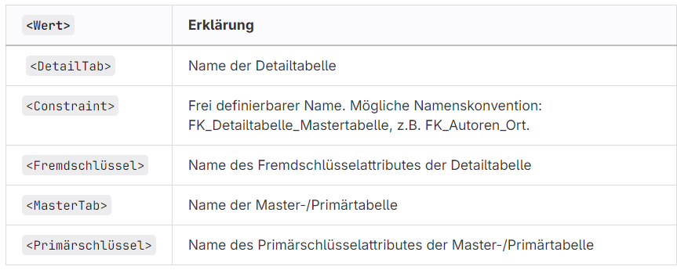

# Ergänzung ALTER TABLE tbl ADD Constraint

Fremdschlüssel hinzufügen:<br>
```
ALTER TABLE <DetailTab>
  ADD CONSTRAINT <Constraint> FOREIGN KEY (<Fremdschlüssel>)
  REFERENCES <MasterTab> (Primärschlüssel);

```


Unique Schlüssel hinzufügen:<br>
```
ALTER TABLE <Tabelle>
  ADD UNIQUE (<FS_Name>); 
```

Fragen:<br>
Fügen Sie ein paar Daten in die Tabellen tbl_Projekt,tbl_Passagier, tbl_Bus, tbl_Fahrer und tbl_Ausweis ein und überprüfen Sie die Beziehungen.
```
-- Angenommen tbl_Projekt_ID_Projekt hat einen Unique-Constraint
INSERT INTO tbl_Projekt (ID_Projekt, Bezeichnung, Budget)
VALUES (1, 'Projekt C', 30000);
```
```
INSERT INTO tbl_Projekt (ID_Projekt, Bezeichnung, Budget)
VALUES (1, 'Projekt A', 10000),
       (2, 'Projekt B', 20000);

INSERT INTO tbl_Bus (ID_Bus, Bezeichnung, Kennzeichen, Anzahl_Plaetze)
VALUES (1, 'Bus 1', 'XYZ 123', '50'),
       (2, 'Bus 2', 'ABC 456', '60');

INSERT INTO tbl_Fahrer (ID_Fahrer, Vorname, Nachname)
VALUES (1, 'Max', 'Mustermann'),
       (2, 'Erika', 'Musterfrau');

INSERT INTO tbl_Ausweis (ID_Ausweis, Nummer, Art, tbl_Fahrer_ID_Fahrer)
VALUES (1, '123456', 1, 1),
       (2, '789012', 2, 2);

INSERT INTO tbl_Passagier (ID_Passagier, Name, Platznummer, tbl_Bus_ID_Bus)
VALUES (1, 'Hans', '1A', 1),
       (2, 'Anna', '1B', 1),
       (3, 'Peter', '2A', 2);
```

Was geschieht, wenn Sie z.B. bei einer 1:c Beziehung zwei gleiche Fremdschlüsselwerte angeben?
Es gibt einen Fehler, wenn ein unique Constraint vorhanden ist

Was geschieht, wenn Sie z.B. bei einer 1:mc Beziehung NULL als FS-Wert angeben?
Es wird ein Datensatz ohne Zuordnung erstellt
Bei NOT NULL gibt es aber einen Fehler