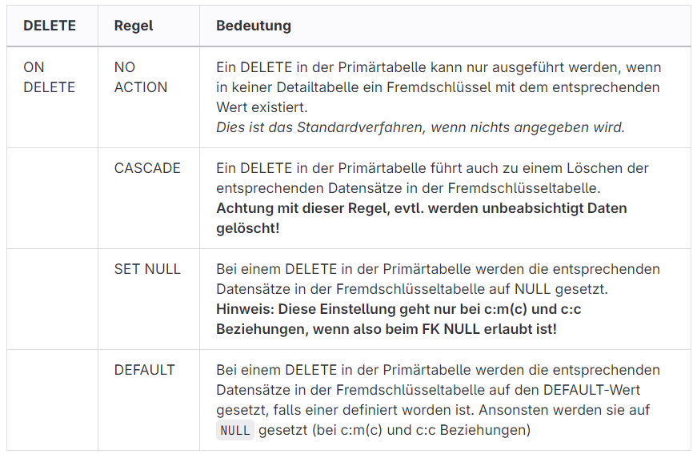

# Fremdschlüssel-Regeln beim löschen 

On Delete Damit sichergestellt wird das die Beziehungen exixtieren

Auch on Update ist möglich. Das kommt zum einsatz wenn ein Primärschlüssel geändert wird.
Die Contraints kann man mit Forward Engineering erstellen. 

