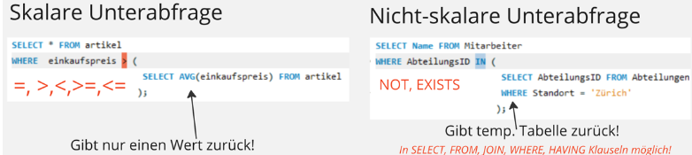

# Subquery (Subselect/Unterabfrage)

Subselect ist eine Abfrage innerhalb einer Abfrage. 
Wird verwendet. um Daten aus einer Tabelle mit Bedingungen in einer anderen Tabelle zu ermitteln.

Unterabfrage Struktur: 

