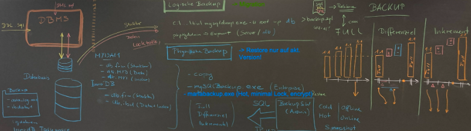

# Backup

## Datensicherung von Datenbanken


Daten müssen gesichert werden und backups enthalten, weil viele Firmen sensible Kundendaten und ihren ganzen Inhalt von Datenbanken bekommen. Zusätzlich findet der Datenaustausch statt welcher sehr wichtig ist und geschützt werden soll. Meistens kommt es zu Datenverlüsten wegen technischem Versagen oder einem Benutzerfehler. Damit der Datenverlust nicht irreversibel ist braucht man eine Datensicherung.

## Möglichkeiten zur Sicherung von Datenbanken
Mit Backups kann der Zustand einer Datenbank zum Zeitpunkt der Datensicherung wiederhergestellt werden. Diese speichert man auf einem externen Speichermedium. 

Online Backups: <br>
Werden erzeugt, ohne dass die Datenbank heruntergefahren werden muss
Datenbak nimmt vorgenommene Änderungen in separaten Bereich auf und führt sie erst im Anschluss an die Sicherung in entsprechende Datei ein.

Offline Backup: <br>
Man fährt die Datenbank für die Zeit der Sicherung herunter. 
Hat den Vorteil, dass es unkompliziert ist aber während dem Backup ist die Anwendung oder Webseite nicht verfügbar. 

Drei Arten der Sicherung: <br>
- Voll Backup
Alle Daten und Strukturen, bracuht aber speicher der sehr hoch ist
- Differentielles Backup
Voll Backup wird erstellt, Daten die gesichert werden oder sich verändert haben werden gespeichert. Es braucht weniger Speicherplatz. Die recovery funktioniert nur mit dem letzten voll backup und den differentiellen backup
- Inkrementielles Backup
Nur die Daten werden kopiert, die sich seit der letzen Sicherung geändert haben oder neu sind. Ein inkrementielles Backup bezieht sich immer auf das vorherige. Jede Datei wird nur einmal gesichert und der Speicherplatz geschont

## Backups erzeugen
- MySQL Dump:
Wird mit Shell Zugriff und integrierter Backup Funktion gemacht, nicht alle Hoster erlauben Zugriff auf diese Funktion

- phpMyAdmin:
Administrations Plattforn für SQL Benutzer, man kann die Datenbank in gewünschtem Format exportieren. Bei grossen Datenbanken gefahr vor Abbruch

- BigDump:
Ergänzung zu phpMyAdmin, kann grosse Backups wieder einspielen

- HeidiSQL:
Die Backup-Lösung für Windows-Systeme basiert nicht auf PHP und hat daher keine Probleme mit großen Backups

- Mariabackup:
Open Source Tool, welches von MariaDB bereitgestellt wird damit man physische Online Backups machen kann. Auf Linux und Windows möglich.

## Datenbank schützen
In Datenbank gespeicherte Files haben oft hohe Bedeutung für die Abläufe und Anzeige. Man sollte Datenbanken mit Sicherheitsmassnahmen schützen, damit man Angriffe vermeiden kann. Regelmässige Backups beugen Datenverlust vor und garantieren langfristige Datensicherheit. 

Eigener Backup-User für logische Backups:
```
GRANT RELOAD, PROCESS, LOCK TABLES, REPLICATION CLIENT ON *.* TO 'backupuser'@'localhost' IDENTIFIED BY 'backup123';
```

## Auftrag

#### Aufgabe 1: Logisches Backup erstellen

##### Variante MySQLDump

1. **Ordner suchen und mysqldump.exe finden:**
   - Navigieren Sie zu Ihrem MySQL-Installationsordner, normalerweise unter `C:\xampp\mysql\bin`.
   - Stellen Sie sicher, dass `mysqldump.exe` vorhanden ist.

2. **Backup mit MySQLDump erstellen:**
   - Öffnen Sie die Eingabeaufforderung (`cmd`).
   - Führen Sie folgenden Befehl aus, um ein Backup der `tourenplaner`-Datenbank zu erstellen:
     ```shell
     C:\xampp\mysql\bin\mysqldump -u root -p --port=3306 tourenplaner > C:\BACKUP\tp_dump.sql
     ```
   - Geben Sie Ihr MySQL-Passwort ein, wenn Sie dazu aufgefordert werden.

##### Variante Workbench

1. **Einstellungen anpassen für MariaDB:**
   - Öffnen Sie MySQL Workbench.
   - Gehen Sie zu `Edit -> Preferences -> Administrator`.
   - Ändern Sie den Pfad für `mysqldump` zu dem MariaDB-Installationspfad.
   - Erstellen Sie ein Backup, indem Sie die Option `Data Export` verwenden und die gewünschte Datenbank auswählen.

##### Variante XAMPP

1. **phpMyAdmin verwenden:**
   - Öffnen Sie phpMyAdmin über das XAMPP Control Panel.
   - Navigieren Sie zu `Export`.
   - Wählen Sie die Datenbank `tourenplaner` aus.
   - Klicken Sie auf `Go`, um das Backup herunterzuladen. Es wird im Download-Ordner gespeichert.

##### Variante DOCKER

1. **Ordner anlegen:**
   - Erstellen Sie den Ordner `C:\db_backup`.

2. **Befehle ausführen:**
   - Öffnen Sie die Eingabeaufforderung (`cmd`).
   - Führen Sie den folgenden Befehl aus, um das Backup im Container zu erstellen:
     ```shell
     docker exec -it mysql /usr/bin/mysqldump -u root -p --databases tourenplaner --result-file=/var/lib/mysql/tourenplaner_backup.sql
     ```
   - Geben Sie das MySQL-Passwort ein.

3. **Backup auf Host kopieren:**
   - Führen Sie den folgenden Befehl aus, um das Backup auf den Host zu kopieren:
     ```shell
     docker cp mysql:/var/lib/mysql/tourenplaner_backup.sql c:\db_backup\
     ```

#### Aufgabe 2: Backup-File analysieren und verifizieren

1. **Inhalt des Backup-Files analysieren:**
   - Öffnen Sie die Datei `tourenplaner_backup.sql` mit einem Texteditor.
   - Sie sollten SQL-Befehle sehen, die die Struktur (DDL) und die Daten (DML) der Datenbank enthalten.

2. **Backup-File verifizieren (Restore):**
   - Löschen Sie die `tourenplaner`-Datenbank:
     ```sql
     DROP DATABASE tourenplaner;
     ```
   - Erstellen Sie die Datenbank neu:
     ```sql
     CREATE DATABASE tourenplaner;
     ```
   - Stellen Sie das Backup wieder her:
     ```shell
     mysql -u root -p tourenplaner < C:\BACKUP\tp_dump.sql
     ```

#### Aufgabe 3: Backup Strategien

1. **Lektüre:**
   - Lesen Sie das Kapitel **«Physical (Raw) Versus Logical Backups»**.

2. **Fragen beantworten:**
   a. **Welchen Backup haben wir in Aufgabe 1 erstellt?**
      - Ein logisches Backup.
   b. **Welche Nachteile hat dieses Backup?**
      - Es kann länger dauern, große Datenbanken wiederherzustellen.
      - Der Wiederherstellungsprozess ist langsamer und komplexer als bei physischen Backups.
      - Logische Backups sind nicht so effizient in Bezug auf Speicherplatz wie physische Backups.

3. **Unterschiede zwischen online- und offline Backups:**
   - **Online-Backups** werden während des laufenden Betriebs der Datenbank erstellt. Die Datenbank bleibt dabei verfügbar.
   - **Offline-Backups** werden erstellt, wenn die Datenbank gestoppt ist. Sie sind normalerweise konsistenter, aber die Datenbank ist während der Sicherung nicht verfügbar.

4. **Snapshot Backup:**
   - Ein Snapshot-Backup ist ein sofortiges Abbild des Dateisystems zu einem bestimmten Zeitpunkt. Es wird häufig in virtuellen Umgebungen verwendet.

#### Aufgabe 4: Physisches Backup (Variante MariaDB, XAMPP)

1. **Full-Backup mit mariabackup.exe erstellen:**
   - Führen Sie den folgenden Befehl aus:
     ```shell
     mariabackup --backup --target-dir=C:\db_backup\mariabackup
     ```

2. **Backupdatenstruktur vorbereiten:**
   - Die Backupdatenstruktur muss vorbereitet werden, um sicherzustellen, dass alle Transaktionen abgeschlossen und die Dateien konsistent sind:
     ```shell
     mariabackup --prepare --target-dir=C:\db_backup\mariabackup
     ```

3. **Parameter für Restore:**
   - Der Parameter zum Wiederherstellen lautet `--copy-back`:
     ```shell
     mariabackup --copy-back --target-dir=C:\db_backup\mariabackup
     ```

4. **Inkrementelles und differentielles Backup:**
   - **Inkrementelles Backup:**
     ```shell
     mariabackup --backup --incremental-basedir=C:\db_backup\mariabackup --target-dir=C:\db_backup\mariabackup_incremental
     ```
   - **Differentielles Backup:** 
     Es wird unterstützt, funktioniert aber ähnlich wie das inkrementelle Backup, jedoch mit dem Unterschied, dass es auf das letzte vollständige Backup basiert.

#### Aufgabe 5: Backup mit externem Backup-Programm

1. **Studium der Anleitung für Acronis:**
   - Besuchen Sie die Acronis-Website und lesen Sie die Anleitungen zum Backup und Restore mit Acronis.
   - Stellen Sie sicher, dass Sie die Schritte verstehen, wie man ein Backup erstellt und wiederherstellt.

Mit diesen Schritten haben Sie ein vollständiges Verständnis für die Erstellung, Analyse und Verifizierung von Backups sowie für die Anwendung verschiedener Backup-Strategien und -Tools.


